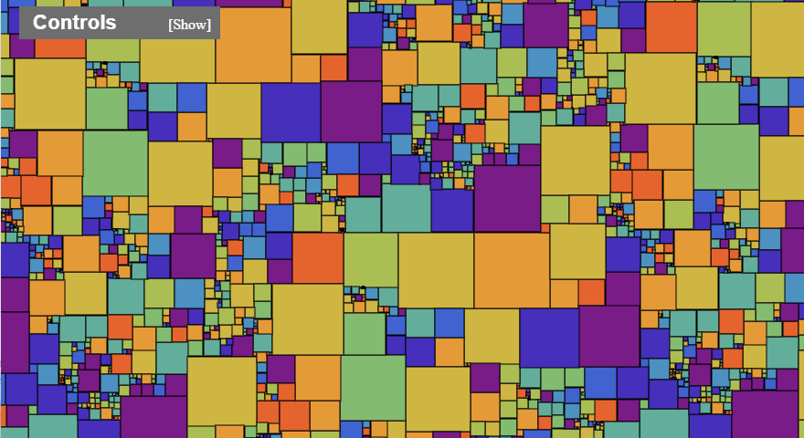
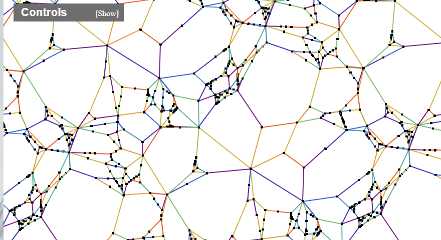

# Warwick Mathematics 3rd Year Essay Project
This randomly generates a square tiling of the plane. It currently generates non-perfect squarings of the plane - the size of each square is not necessarily unique.

Currently, the number of unique squares generated can be selected by the user, ranging from 10 - 4000 but this is the upper boundary, so if 10 is selected you might get lucky and see only one unique square tile the plane!

In the future, I hope to build on this with perfect squarings of the plane - these are of course a lot more complex to add functionality and computationally wise.

    
    

> An example of a tiling of the plane, and corresponding smith diagram/graph generated using this algorithm.

You are able to navigate the plane, by rotation and by zooming in and out.

Using the small collapseable menu, you are also able to;
+ Turn on/off the shading of the squares, leaving you with the outlines of each individual square.
+ Change the colour scheme of the shading of the squares, if you want a duller or different visual experience. 
+ Switch between the view of the squaring and it's simplified smith diagram/graph. 
+ Alter the amount of unique squares generated in the plane, picking from **10**-**4000** currently.
+ Generate a new, cool tiling.

> All of the above controls can also be carried out by a keypress. Keys **C**, **S**, **G** and **Spacebar** respectively.

*This code is hosted using the github.io pages functionality*